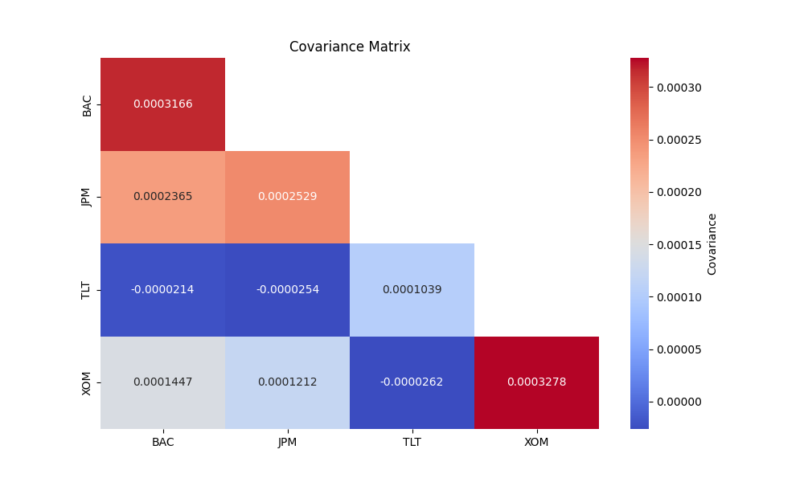

## Random Variables

Random variable is just a way to like assign a variable to some random outcome

EX: Toss a fair die, X = number it ends up showin', possible values: 1,2,3,4,5,6
Each has probability 1/6

A random variable is not random by itself, it's a function of an underlying random process

## Expectation (Expected Value)

The expected value is the "long run average" of a random variable 
Given the probabilities of all events and all, the expected value is the value we would
most likely get.

Computation varies between discrete vs continuous values:

**E[X]=x∑​x⋅P(X=x)(discrete case)**

**E[X]=∫xf(x)dx(continuous case)**

An example for a fair die: 

**E[X]=61+2+3+4+5+6​=3.5**

## Variance 
Variance is a measure of how much a variable spreads out from its mean
--> Basically the average squared deviation from the mean
--> Standard deviation is just the square root of variance

Var(X)=E[(X−E[X])2]

Die roll example:
**Var(X)=61​i=1∑6​(i−3.5)2=35/12≈2.92**

How to interpret this --> Average SQUARED deviation from the mean (3.5) is approximately 2.92
The average deviation or standard deviation would be 1.7
We square it to punish further values from the mean more that's all

## Covariance
Measures how two random variables vary TOGETHER

**Cov(X,Y)=E[(X−E[X])(Y−E[Y])]**

If positive, when X is above its mean Y tends to be above its mean
If negative, when 𝑋 is above its mean, Y tends to be below its mean
If zero, they don't have a linear relationship (not necessarily independent of each other however).

**Cov(X,Y)=E[XY]−E[X]E[Y]**

Example: Height vs Weight

𝑋 = person’s height, 
𝑌 = person’s weight.

Generally: taller people weigh more → covariance is positive.
If Y were something unrelated (like shoe size in a dataset where it doesn’t correlate), covariance could be near zero.

## The Covariance matrix

So for 2 random variables, we had Cov(X,Y) = E[(X−μX​)(Y−μY​)]

Now suppose we have a vector of random variables: X[X1,X2,...,Xn]

Covariance matrix is an n x n matrix that captures covariance between every pair of variables 

Properties: 
- Diagonal = Variance of each variable
- Off-diagonal entries are covariances
- It's symmetric Cov(Xi,Xj) = Cov(Xj, Xi)

Random Variable vector is baiscally an array of features that can vary randomly
in the population or dataset

(E.G) use in finance:
We can use the covariance matrix to determine the covariance between two stocks
or a stock with itself ( variance ) which is an indicator of that stock's volatility.

Measuring covariance between different stocks, however it is useful to know how
stocks perform with relation to each other.

Why is covariance important:
Investors don't usually only hold individual stocks, they hold portfolios
An important point when making a portfolio is measuring how does the risk of the underlying assets
combine ? 

That's where covariance comes in:
- High, positive covariance means stocks move together, adding both to portfolio, doesn't reduce risk much
  - Ex: AAPL and MSFT (both big tech). If tech crashes, both fall at once, adding both doesn't reduce portfolio risk
  as it's a lack of diversification, risk is similar
- Low or negative covariance means that they move differently:
  - Ex: Some oil company vs Airline company
    - When oil prices rise, jetfuel is more expensive, Airlines suffer as a consequence
    - Holding both smooths your returns, one offsets the other
    - This introduces diversification, minimizng risk

Example of correlation matrix:

The following Figure displays the covariance matrix computed from daily returns over the past 5 years
for these four stocks JP Morgan Chase, Bank of America, TLT ( treasury bonds etf ) and XOM ( Exxon Mobil Corp)

Key takeaways from this heat map:
1. Volatility
   The diagonal shows the variance of each stock’s daily returns.
   Taking the square root gives the volatility.
   Over the last 5 years, BAC and XOM had the highest volatility,
   TLT the lowest, and JPM was in between.

2. Off-diagonal --> Covariances
  1. Strong Positive
    - BAC-JPM = 0.000236 is relatively high, this is expected as these assets of the same industry
    meaning they (more or less) rise and fall together
    - BAC-XOM = 0.000145, JPM-XOM = 0.000121 -> 
    Banks and Energy sectors show positive covariance, as both benefit in economic upswings
     (growth and inflation environments)

  2. Negative (opposite movements)
    - BAC–TLT: -0.000021, JPM–TLT: -0.000025
    Is this expected ? Yes.
    Why?
     When interest rates rise,
     bonds prices fall, hurting TLT. At the same time, moderate rate increases support
     bank profitability through higher lending margins. Conversely, when recession fears push
     investors into Treasuries (TLT uppp), banks often fall because of credit risk, explaining
     this negative relationship.

## Sharpe Ratio:

The Sharpe ratio is a measure of the risk-adjusted return of a portfolio
compared to the risk-free rate of return (which is typically represented by a government bond).

$$
\text{Sharpe Ratio} = \frac{R_p - R_f}{\sigma_p}
$$
Where R_p is the portfolio return, R_f is the risk-free rate of return, and
$\sigma_p$ is the standard deviation of the portfolio.

Example: 

Ressources used to learn:

https://investopedia.com
https://wire.insiderfinance.io/introduction-to-quant-investing-with-python-c215d1014a25
https://wire.insiderfinance.io/the-science-of-smart-investing-portfolio-evaluation-with-python-3e2e977c8b79
https://medium.com/latinxinai/portfolio-optimization-the-markowitz-mean-variance-model-c07a80056b8a
https://www.kaggle.com/code/lusfernandotorres/data-science-for-financial-markets#building-portfolio